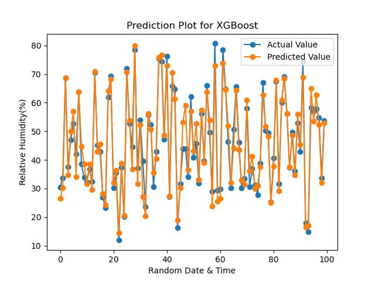
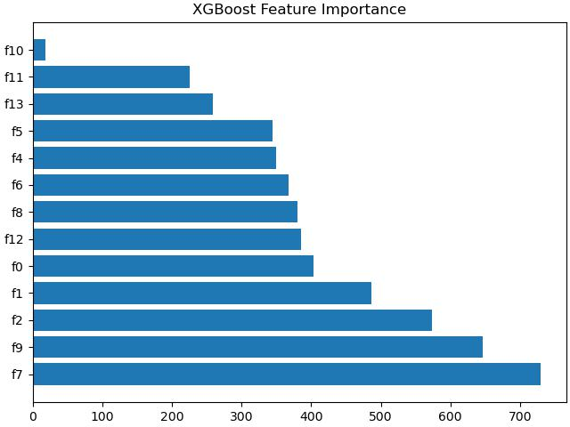

# Relative Humidity prediction based on Gases concentration and Temperature available

## Overview
1. Humidity prediction is one of the important aspects in weather prediction analysis to find out rain precipitation predictions.
2. This project is a regression model that will try to predict relative humidity (humidity %) in the given area using gases concentration and temperature available in that particular area.  
3. The dataset contains 9358 instances of hourly averaged responses from an array of 5 metal oxide chemical sensors embedded in an Air Quality Chemical Multi-Sensor Device.
4. The device was located on the field in a significantly polluted area, at road level, within an Italian city. Data were recorded from March 2004 to April 2005.
5. Ground Truth hourly averaged concentrations for CO, Non-Metanic Hydrocarbons, Benzene, Total Nitrogen Oxides (NOx), and Nitrogen Dioxide (NO2) were provided by a co-located reference certified analyzer. 
6. Missing values are tagged with -200 value.

## Dataset 

The dataset can be downloaded from [here](https://archive.ics.uci.edu/ml/datasets/Air+Quality).

## EDA and Feature Engineering

1. Read and view the data file.
2. NA values are filled as -200. So replace -200 with np.NaN
3. The feature column NMHC(GT) contains almost 90% NA values so we will delete it.
4. Delete all the rows with NA values.
5. Let us make the year, month and day as 3 new features from the Date column.
6. Extract Hour from time and make it as a new feature. As humidity depends upon time and season these features are very imp.
7. Now delete the Date and Time column.
8. As our target is predicting RH(Relative Humidity), we must drop AH(Absolute Humudity).
9. Use df.info() to make sure all features are numeric and NA values are removed.
10. Use df.isnull().sum() to reconfirm that NA values are completely removed.

## Machine Laerning Models

**We have trained this dataset on various ML Models. Let us compare the Test Results on the basis of their performance.**

### 1. Ridge Regression (alpha=1)
Percentage Accuracy for Test Data 84.74 %

Mean Absolute Percentage Error for Test Data 15.26%

### 2. Polynomial Regression with degree of 2 (Ridge Regression (alpha=1))
Percentage Accuracy for Test Data 89.90 %

Mean Absolute Percentage Error for Test Data 10.10 %

### 3. Polynomial Regression with degree of 3 (Ridge Regression (alpha=1))
Percentage Accuracy for Test Data 91.53 %

Mean Absolute Percentage Error for Test Data 8.47 %

### 4. Random Forest Regressor
Percentage Accuracy for Test Data 91.60 %

Mean Absolute Percentage Error for Test Data 8.40 %

### 5. Gradient Boosting Regressor
Percentage Accuracy for Test Data 88.98 %

Mean Absolute Percentage Error for Test Data 11.02 %

### 6. XGBoost Regressor
Percentage Accuracy for Test data is 92.88 %

Mean Absolute Percentage Error for Test data is 7.12 %

## Conclusion 
The XGBoost Regressor is performing best compared with all other models.

## XGBoost Results for 100 samples - Actual Value and Predicted Value

## XGBoost Feature Importance

### Now, let's jump into the Jupyter Notebook and take a look at the Python Code Implementation.
